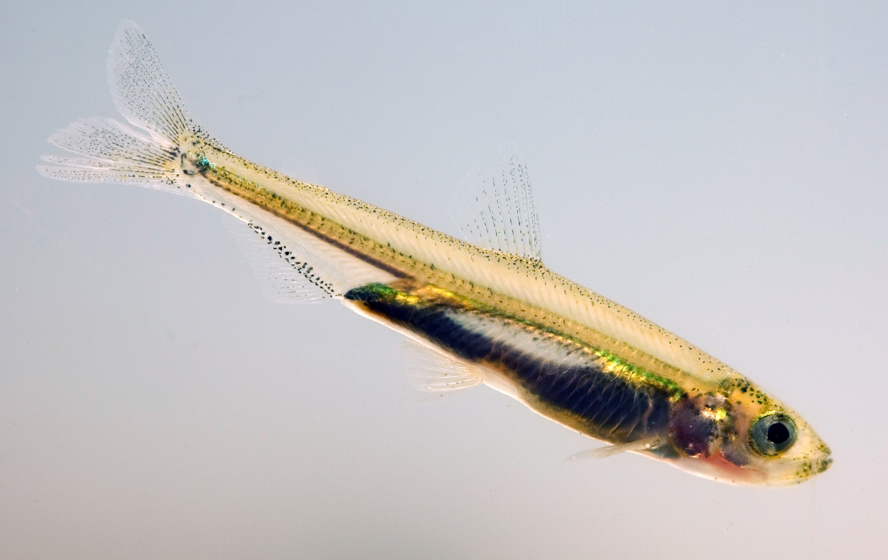
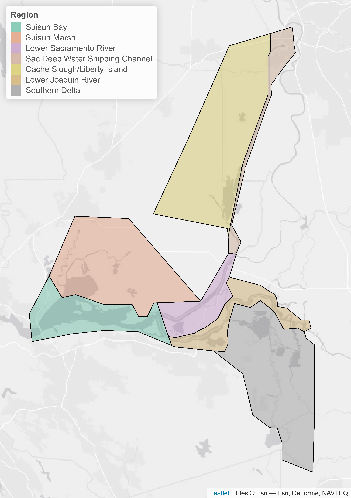

<style type="text/css">
h1.title {
  text-align: center;
}
h4.author { 
  text-align: center;
}
h4.date {
  text-align: center;
}
h2 {
  text-align: center;
}
p.caption {
  font-size: 0.9em;
  font-style: italic;
  padding-top: 15px;
  padding-bottom: 15px;
}
</style>

```{r setup, include=FALSE, echo=FALSE}
knitr::opts_chunk$set(echo = F, warning = FALSE, fig.height=4, fig.width=7.5, fig.align="center", fig.pos='H')

require(sf)
require(tidyverse)
require(readxl)
require(lubridate)
require(RColorBrewer)
require(ggthemes)

source("DSCWQ.R")
source("DSCFish.R")
source("DSCZoop.R")
source("DSCPhyt.R")
source("DSCDayflow.R")
source("DSCBivalves.R")
source("DSCMetadata.R")
source("DSCDater.R")

Data <- DSCDater()

WQ<-DSCWQer(Data$Water_quality)
DF<-DSCDayFlower()
PH<-DSCPhyter(Data$Phytoplankton)
FISH<-DSCFisher()
```

<br>

# Introduction

This report is intended for managers and scientists interested in tracking environmental conditions considered important for Delta Smelt (*Hypomesus transpacificus*). The variables shown in this report represent a selected subset of the variables that have been incorporated into conceptual models of Delta Smelt life history and analyses of the Delta Smelt population and its habitat. The variables selected have also been consistently measured as part of the long term monitoring efforts of the Interagency Ecological Program and other entities. Data for selected variables are summarized from 2002 to present, to reflect conditions since the beginning of the Pelagic Organism Decline. The report does not include data from short-term special studies. This report also does not provide detailed assessments of trends or the outcomes of specific management actions. Such assessments require specialized analysis and synthesis by expert teams and are beyond the scope of this report.

Delta Smelt is a pelagic species that prefers cooler temperatures in low salinity, turbid habitats. Some additional habitat concerns are food availability, invasive species, contaminants and harmful algal blooms.

Delta Smelt is generally described as a semi-anadromous species, moving from brackish low salinity (0.5-6 PSU) habitats to tidal fresh water habitats to spawn; however, the species expresses a variety of life histories. These spawning movements occurs in the winter, after the “first-flush” of turbid freshwater following the first major precipitation event. A variable proportion of the population also exhibit resident life histories, residing in freshwater or brackish water for their entire life cycle.

Delta Smelt are most commonly found in the North Delta region (Cache Slough/Liberty Island and Sacramento River Deep Water Shipping Channel) during the winter spawning season. Larval and juvenile fish move into low salinity habitat (Suisun Bay and Marsh, Lower Sacramento River) during the spring and early summer and remain there until their winter spawning movements into fresh water. The Lower San Joaquin River and Southern Delta are highly modified habitats characterized by warm summer temperatures and low turbidities with low abundance of Delta Smelt. Proximity to the water export facilities, which may result in some probability of entrainment under some environmental conditions and operations, may also be a factor.

<br>

```{r Delta_Smelt_photo, echo=FALSE, fig.cap="Figure 1. Juvenile Delta Smelt Dale Kolke / DWR", out.width="55%"}

```

# Methods

Most variables are divided among 7 of the 8 regions from the [Enhanced Delta Smelt Monitoring (EDSM)](https://www.fws.gov/lodi/juvenile_fish_monitoring_program/jfmp_index.htm) 2018-19 phase I strata, with the Western Delta region excluded because it is almost never occupied by Delta Smelt. Missing data are denoted by vertical dashed lines. Data are plotted from 2002 (or the start of data collection) until present. The graphs presented in this report are for the season when a selected variable is most critical in the life history of Delta Smelt, as determined from literature. The graphs also highlight in red the most recent year, to facilitate visual comparisons of recent conditions with previous years.

```{r Delta_map, echo=FALSE, out.width="55%", fig.cap="Figure 2. The Sacramento San Joaquin Delta divided into the EDSM 2018-19 phase I strata."}

```


```{r Metadata_figure, echo=FALSE, warning = FALSE, message=FALSE, error=FALSE, fig.height=8, fig.cap="Figure 3. Average yearly sampling effort for each variable, region, season, and survey. Cyanobacteria data are included in the phytoplankton category. Delta Outflow and X2 are derived from the Dayflow model while Delta Smelt abundance is represented by the official indices produced by the Fall Midwater Trawl (FMWT), Spring Kodiac Trawl (SKT), Summer Townet (STN), 20-mm Survey (20mm), and the Enhanced Delta Smelt Monitoring (EDSM) program."}
DSCMetadater(Data)
```

# Abiotic drivers

## Delta outflow

```{r Outflow, fig.height=3.7, fig.cap="Figure 4. Monthly modeled Delta outflow from the Dayflow model. Fall months are highlighted in orange."}
DF$Out
```

Delta Smelt abiotic habitat (as defined by salinity, turbidity, and water temperature) is determined largely by freshwater flow because Delta Smelt occupy the fresh, and low salinity portion of the SFE during the summer and fall. **High Delta outflow in the fall is believed to be favorable for Delta Smelt because it increases the amount of available low salinity habitat in Suisun Bay and Suisun Marsh.** High outflow may also improve other abiotic environmental conditions, reduce harmful algal blooms, and increase food production.

## X2

```{r X2, fig.height=3.7, fig.cap="Figure 5. Monthly modeled X2 from the Dayflow model. Fall months are highlighted in orange."}
DF$X2
```

X2 is a measure of the location of low salinity habitat. X2 is defined as the horizontal distance in kilometers from the Golden Gate up the axis of the estuary to where tidally averaged near-bottom salinity is 2. X2 is used as a proxy for the amount of low salinity habitat in the Delta; **lower X2 in the fall generally means more low salinity habitat is available**. 

## Summer temperature

```{r Temperature, fig.height=7, fig.cap="Figure 6. Mean water temperature of the coldest (bottom of gray shading), average (black line), and hottest (top of gray shading) months of the summer, shaded by suitability for Delta Smelt. Means were calculated by pooling discrete measurements from the STN, EMP, and EDSM surveys for each month of the summer. Vertical dotted lines represent years with missing data."}
WQ$Temperature
```

Delta Smelt are sensitive to high water temperatures. Results from various studies suggest that **Delta Smelt growth is optimal at water temperatures $\le$ 20 $^\circ$C**, growth likely declines at 20-22 $^\circ$C with poor growth at 22-24 $^\circ$C, and the onset of physiological stress around 24 $^\circ$C. Chronic exposure to water temperatures above 26 $^\circ$C are likely fatal. Delta Smelt are rarely captured above 22 $^\circ$C.

## Fall Secchi depth

```{r Secchi, fig.height=7, fig.cap="Figure 7. Mean fall Secchi depth from the FMWT, EMP, and EDSM surveys. Means were calculated by pooling discrete measurements of the three surveys for the fall of each year. Gray shading represents the standard deviation across all measurements from the fall of each year."}
WQ$Secchi
```

Secchi depth is a measure of turbidity. **Lower Secchi depth indicates higher turbidity, which is preferred by Delta Smelt**. Delta Smelt distributions are clustered around areas with low Secchi depth (high turbidity) in the fall. Delta Smelt evolved in the historically turbid San Francisco Estuary and rely on this turbidity to effectively feed and hide from predators. 

## Fall salinity

```{r Salinity, fig.height=7, fig.cap="Figure 8. Mean fall salinity from the FMWT and EMP suveys. Means were calculated by pooling discrete measurements of the two surveys for the fall of each year. Gray shading represents the standard deviation across all measurements from the fall of each year."}
WQ$Salinity
```

**During the fall, Delta Smelt prefer fresh to brackish water and are most abundant in salinities of 1-2 PSU**, are rare in salinities higher than 6 PSU, and are not found in salinities above 14 PSU. Juveniles rely on low salinity habitat in the fall to feed, grow, and mature into adults. 

# Biotic drivers

## Summer chlorophyll concentrations

```{r Chlorophyll, fig.height=3.8, fig.cap="Figure 9. Mean summer chlorophyll concentrations from EMP. Means were calculated by pooling discrete measurements for the summer of each year. No data are available from the Sac Deep Water Shipping Channel or Cache/Slough/Liberty Island regions. Gray shading represents the standard deviation across all measurements from the summer of each year."}
WQ$Chlorophyll
```

Chlorophyll is a measure of productivity at the base of the food web. **Higher chlorophyll is an indicator of more food availability for zooplankton, which are important prey for many fish, including Delta Smelt.** 

## Summer phytoplankton composition

```{r Phytoplankton, fig.cap="Figure 10. Summer phytoplankton community composition from EMP. Canobacteria are presented in Fig. 11. Means were calculated by pooling discrete measurements for the summer of each year. No data are available from the Sac Deep Water Shipping Channel or Cache/Slough/Liberty Island regions. Data are only shown from 2008 - 2018 to reflect the timeframe of consistent sample processing methodology. Vertical dotted lines represent years with missing data."}
PH$Phytoplankton
```

Phytoplankton are the base of the aquatic food web. They provide food for zooplankton, which are important prey for Delta Smelt. **Diatoms and cryptophytes are considered the best quality zooplankton food.** 

## Summer cyanobacteria 

```{r Cyanobacteria, fig.height=3.6, fig.cap="Figure 11. Summer cyanobacteria abundance from EMP. Means were calculated by pooling discrete measurements for the summer of each year. No data are available from the Sac Deep Water Shipping Channel or Cache/Slough/Liberty Island regions. Data are only shown from 2008 - 2018 to reflect the timeframe of consistent sample processing methodology. Vertical dotted lines represent years with missing data."}
PH$Cyanobacteria
```

**Cyanobacteria are an unfavorable type of phytoplankton** Cyanobacteria are considered poor quality zooplankton food and can produce toxins, such as microcystins. 

## Summer *Microcystis*

```{r Microcystis, fig.height=4.6, fig.cap="Figure 12. Summer Microcystis bloom intensity from EMP and STN. Means were calculated by pooling discrete measurements from the two surveys for the summer of each year. Microcystis bloom presence and intensity are measured on a qualitative scale from 1-5. Vertical dotted lines represent years with missing data."}
WQ$Microcystis
```

*Microcystis* is a toxin-producing cyanobacteria. The toxins, microcystins, are harmful to human and animal health. **_Microcystis_ toxins can directly harm zooplankton populations which may affect food resources for Delta Smelt.** Blooms occur yearly in the summer and fall. 

## Fall zooplankton

```{r Zooplankton, fig.height=3.9, fig.cap="Figure 13. Fall zooplankton biomass and composition from EMP. Means were calculated by pooling discrete measurements for the fall of each year. No data are available from the Sac Deep Water Shipping Channel or Cache/Slough/Liberty Island regions."}
DSCZooper(Data$Zooplankton)
```

Delta Smelt rely on zooplankton for food throughout their entire lives. **Calanoid copepods and mysids are particularly important in the diet of Delta Smelt.**

## Fall invasive bivalve abundance

```{r Bivalves, fig.height=4.1, fig.cap="Figure 14. Fall abundance of two invasive bivalve species (the overbite clam Potamocorbula amurensis and the freshwater clam Corbicula fluminea). Means were calculated by pooling discrete measurements for the fall of each year. No data are available from the Sac Deep Water Shipping Channel or Cache/Slough/Liberty Island regions."}
DSCBivalver(Data$Bivalves)
```

**Invasive bivalves (clams) consume phytoplankton and zooplankton, reducing the amount of food available for fishes.** The overbite clam *Potamocorbula amurensis* invaded the estuary in 1987, prefers brackish waters, and feeds on both zooplankton and phytoplankton. The freshwater clam *Corbicula fluminea* invaded sometime before 1945, prefers freshwater, and feeds primarily on phytoplankton but can also feed on organic material in the substrate when phytoplankton are rare. 

# Delta Smelt

## IEP Delta Smelt index values

```{r Delta_smelt_IEP, fig.height=6, fig.cap="Figure 15. Official Delta Smelt indices from four Interagency Ecological Program (IEP) surveys: Spring Kodiak Trawl (SKT), the Summer Townet Survey (STN), the 20mm survey, and the Fall Midwater Trawl (FMWT). The 20mm index could not be calculated in 2018 due to low catch. For all surveys, indices are calculated from selected set of stations that have been consistently sampled over the full time series of the survey."}
FISH$IEP
```

Delta Smelt abundance is estimated by 4 IEP surveys that target different life stages. The Spring Kodiak Trawl (SKT) estimates spawning adult Delta Smelt abundance from January through May, the Summer Townet Survey (STN) estimates juvenile Delta Smelt abundance in June, the 20mm survey estimates larval and juvenile Delta Smelt abundance from March through August, and the Fall Midwater Trawl (FMWT) estimates juvenile and adult Delta Smelt abundance from September through December. 

## EDSM Delta Smelt abundance

```{r Delta_Smelt_EDSM, fig.height=5, fig.cap="Figure 16. Monthly Delta Smelt abundance estimates from the Enhanced Delta Smelt Montoring survey (EDSM). No Delta Smelt were collected from the Southern Delta. Vertical dotted lines represent months with missing data. Note that the y-axis is on the log scale and the x axis starts in mid 2017. The y axis starts at the lowest estimated detection value; all values below the limit are 0s."}
FISH$EDSM
```

EDSM is a new survey that calculates Delta Smelt abundance estimates throughout the year.